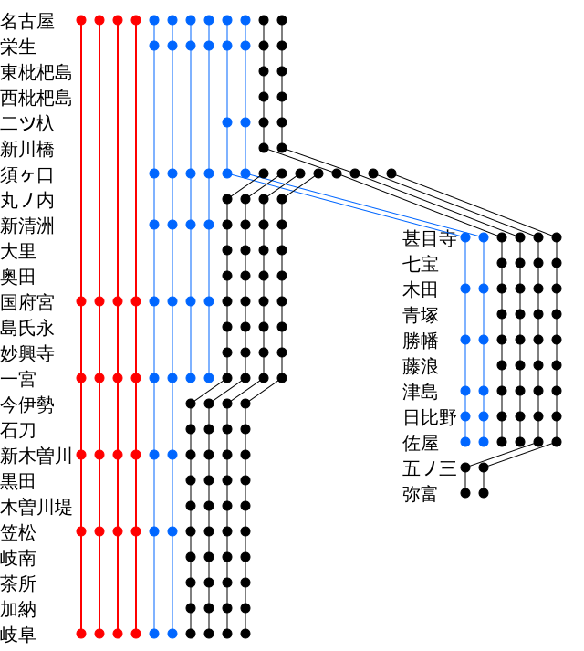

# TSでダイヤの可視化

---

## 誰よ
- 名前: 山本瑶祐(ぽんこつ)
- 所属: デジカルチーム
- チーム内SREとして主にインフラ見たり
- Scalaが好きです

---

## やったこと
- 鉄道ダイヤを可視化するツールを作った
- JSONからSVGを生成する
- https://ponkotuy.github.io/diagram-svg/menu.html

---

## 成果物(東海道新幹線)


---

## 成果物(名鉄名古屋本線)


---

## 何がうれしいのか
- 鉄道ダイヤの表現方法は色々ある
  - 経路検索
  - 時刻表
  - 駅時刻表
  - ダイヤグラム
- 路線のダイヤの特徴にフォーカスしたいが無い
  - 本数/速達列車比など
- 無いなら作るしかないじゃない
- 他の人も似たような図が作れる

---

## 技術構成
- TypeScriptベース
- SVGはRaphaelでレンダリング
- Webpackでビルド
- browser-syncでデバッグ
  - CORS対策
- Github Pagesで公開
- Python製ツール

---

## TypeScript
- 当初はJavaScript
  - 100行で解読不能になって移行
- 型は正義
- Arrayのメソッドが使えなかったりする

---

## Raphael
- 大天使の1人
- 当初はsvgsnap
  - TypeScriptとの相性が悪くて移行
- @types/raphaelで型が付く

```
paper = Raphael(id, width, height);
paper.path(`M${x},${y} L${x2},${y2}`); // LINE
paper.circle(x, y, size);
text = paper.text(x, y, "text");
text.attr({'font-size': 20});
```

---

## Python製ツール
- JSON手書きはつらかった
- Google SpreadsheetからJSONを生成
- Webに移行した方が良さそう

---

## まとめ
- 新しい鉄道ダイヤ表現方法の提唱
- TypeScriptでSVGレンダリング
- GitHub Pagesで成果物出せるフロント良き
